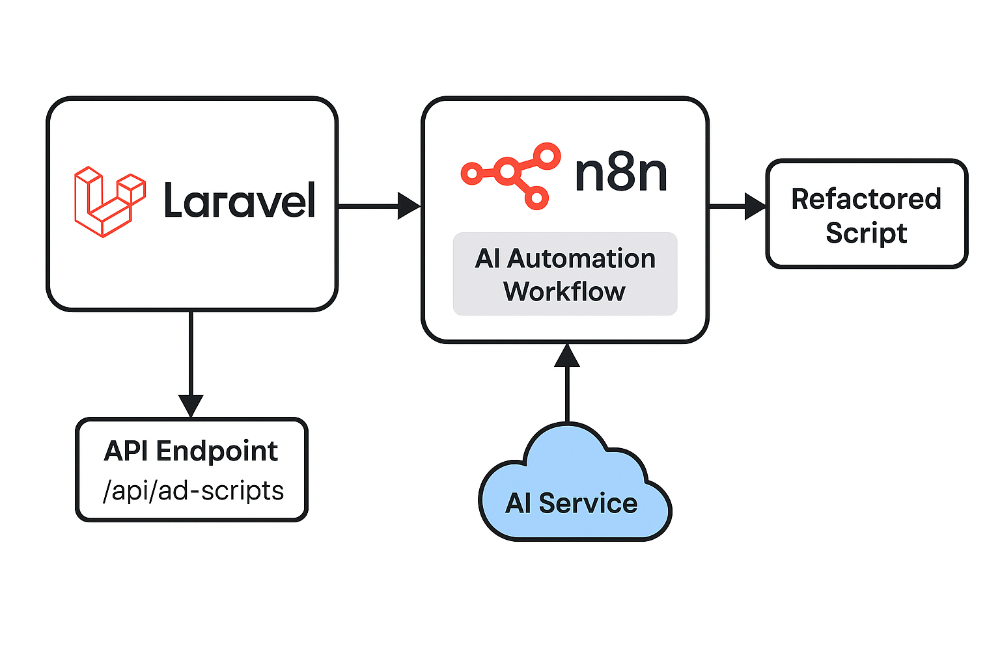

## Ad Script AI Refactor (Laravel + n8n)

This project automates advertising script refactoring using Laravel and n8n.
It sends ad script tasks from Laravel to an n8n workflow that uses AI (e.g., OpenAI) to analyze and rewrite the input.
The workflow then returns the improved version back to Laravel to be persisted.

## Flow
1. A new task is created via the Laravel API (POST /api/ad-scripts).

Laravel dispatches a job that sends the task data to n8n.

n8n processes the script using an AI model (e.g., OpenAI GPT).

n8n sends the results back to Laravel via a callback route.

The task is then updated in the database with the AI-generated output.
## Tech Stack

Laravel, mysql, n7n, docker

### Tips
1. Build docker images (app, n8n, db)
  ```bash
docker compose up --build
```
Services included:

app – Laravel backend on http://localhost:8000

n8n – n8n dashboard on http://localhost:5678

db – MySQL database

2. Copy .env.example to .env and configure the variables bellow:
  ```bash
APP_ENV=local
APP_KEY=base64:your_key_here
DB_HOST=db
DB_DATABASE=laravel
DB_USERNAME=root
DB_PASSWORD=secret

N8N_URL=http://n8n:5678
N8N_API_KEY=your-n8n-api-key
```

3. You can run the migrations
  ```bash
   docker compose exec app php artisan migrate
```

4. Build front-end
  ```bash
npm install
npm run dev
```
5Import the Ad Script AI Agent.json workflow from the /n8n folder into your n8n dashboard.


